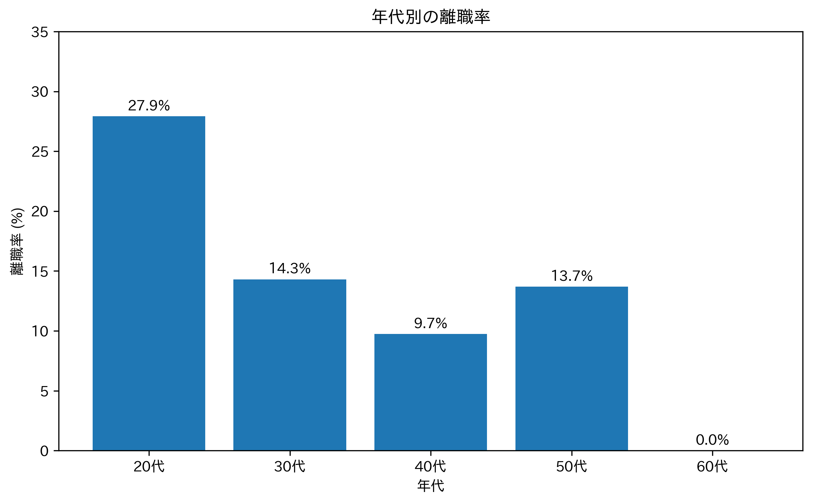
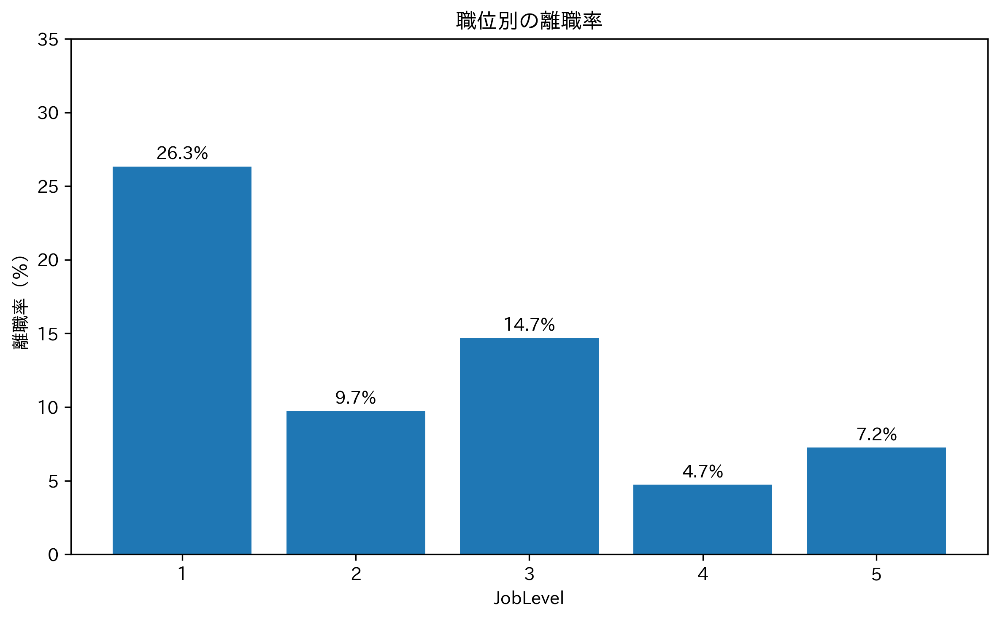
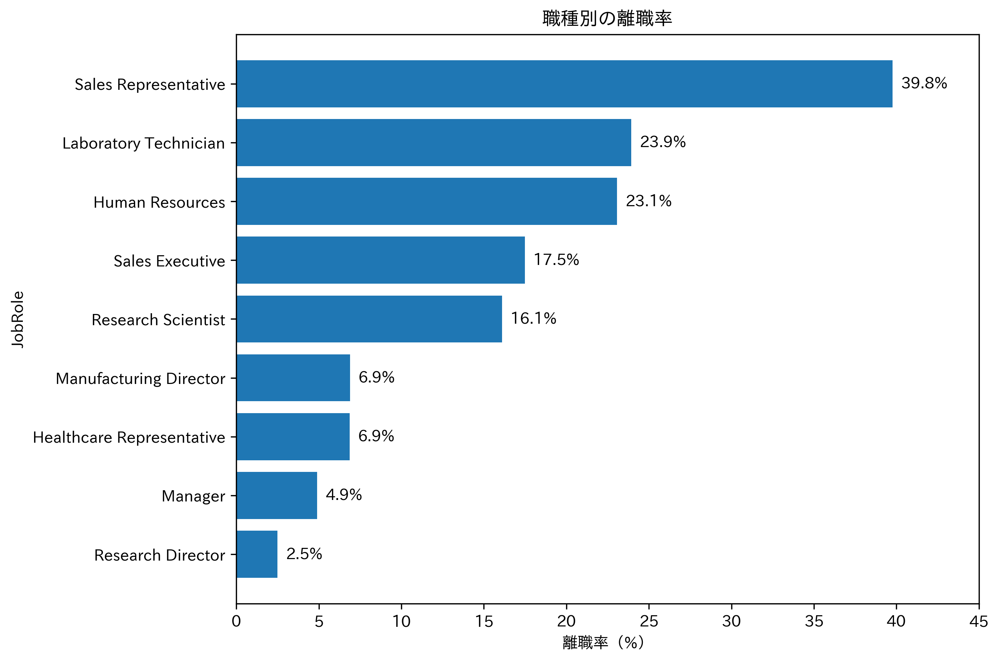
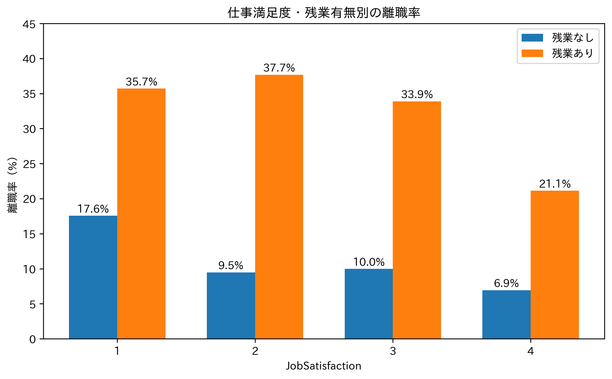
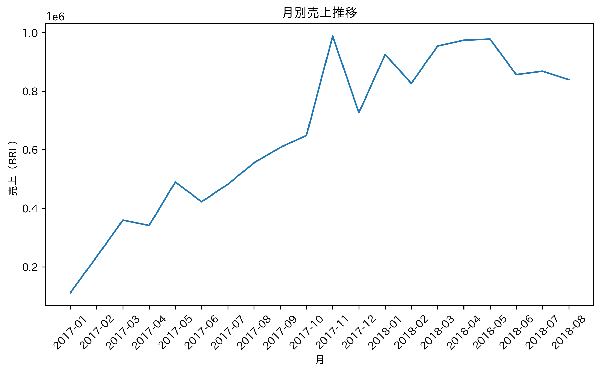
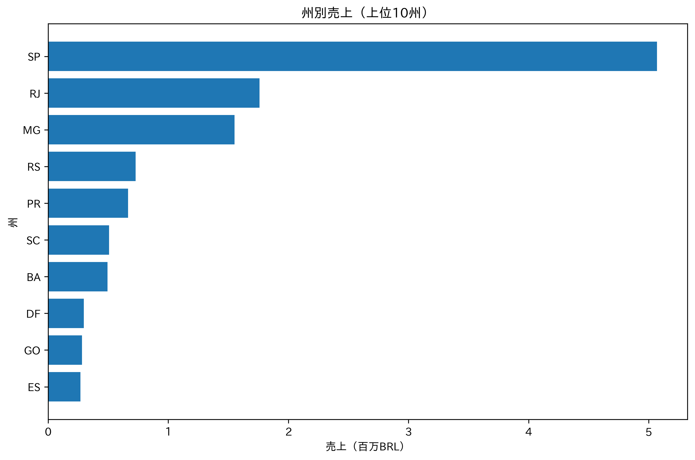
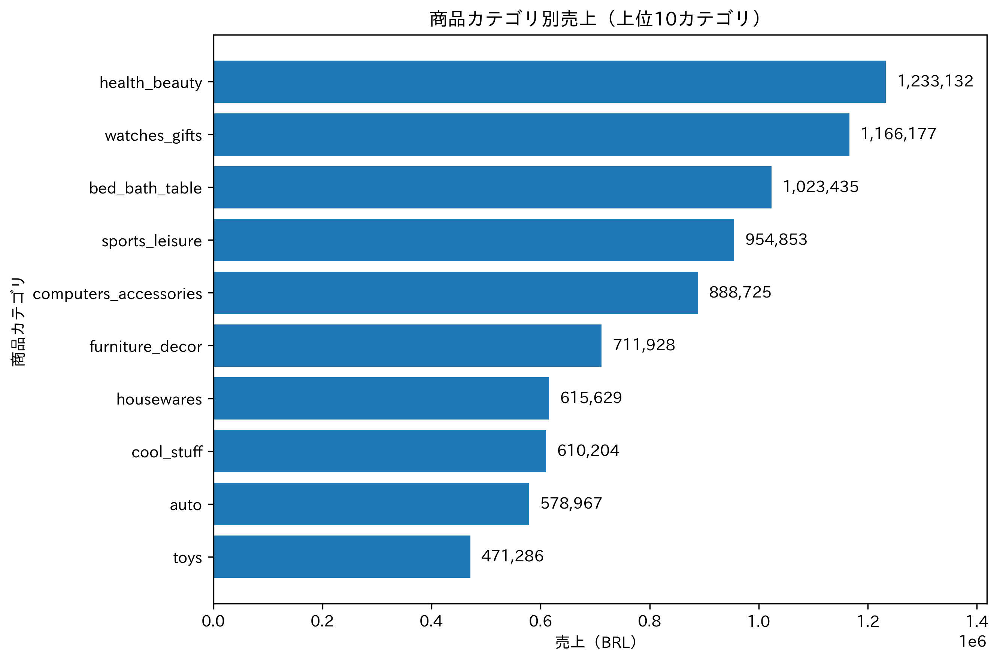
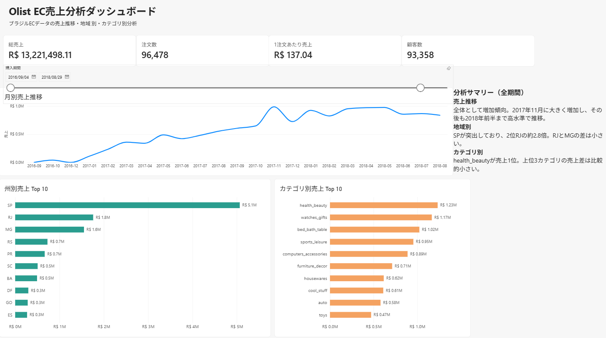

# データアナリスト　ポートフォリオ

## 自己紹介

約7年間、人事・労務業務に従事してきました。
現在はデータアナリストへの転職を目指し、
SQL・Python・pandasを中心に学習しています。

データ分析を通じて、
業務改善に貢献できるアナリストを目指しています。

## スキル

- SQL（GoogleSQL / BigQuery）
- Python
- pandas
- Power BI
- Excel
- Word
- PowerPoint

---

# 離職率の分析

## 概要

IBM HR Analytics Employee Attrition & Performanceデータセットを使用し、従業員の離職にどのような特徴が見られるのかを分析しました。

年齢、勤続年数、職位、職種、残業、仕事満足度などの観点から離職率を比較し、離職率が高い従業員グループの特徴を確認しました。

## 使用技術

- Python
- pandas
- Matplotlib
- Google Colab

## 分析結果

### 1. 年齢/勤続年数（Age / YearsAtCompany）

年代別の離職率を確認したところ、**20代の離職率が27.9%と最も高い**結果となりました。

また、退職者の平均年齢は33.6歳、在籍者は37.6歳であり、退職者は在籍者と比較して若い傾向が確認されました。

年代別に退職者の勤続年数を見ると、20代の平均勤続年数は2.8年、30代は5.1年であり、若年層ほど比較的早期に退職している傾向が見られました。

一方、50代の退職者は平均勤続年数が10.8年と長いものの、中央値は6年でした。最大値が40年であることから、一部の長期勤続者が平均値を押し上げている可能性があります。

### 2. 職位（JobLevel）

職位別では、**JobLevel 1の離職率が26.3%と最も高くなりました**。

退職者237人のうちJobLevel 1は143人で、__退職者全体の約60.3%__ を占めていました。

また、JobLevel 1の退職者は平均勤続年数3.1年、中央値2年であり、比較的勤続年数が短いことが確認されました。

### 3. 職種（JobRole）

職種別では、**Sales Representativeの離職率が39.8%と最も高くなりました**。

一方、退職者数ではLaboratory Technicianが62人と最も多く、Sales Representativeの33人を上回りました。このことから、離職率の高さと退職者数の多さは分けて考える必要があります。

また、Sales Representativeは83人中76人、**約91.6%がJobLevel 1**で構成されていました。そのため、Sales Representativeの高い離職率については、職種だけでなくJobLevelの構成も考慮する必要があります。

### 4. 残業/仕事満足度（OverTime / JobSatisfaction）

残業なしの従業員の離職率が10.4%だったのに対し、残業ありでは30.5%となり、**残業ありの従業員は約2.9倍の離職率**となっていました。

JobSatisfaction別では、満足度1の離職率が22.8%と最も高く、満足度4では11.3%と最も低くなりました。一方、満足度2と3では離職率に大きな差は見られませんでした。

さらにJobSatisfactionとOverTimeを組み合わせて確認したところ、**すべてのJobSatisfactionで、残業ありのグループは残業なしのグループより離職率が高くなりました**。満足度4でも、残業なしの離職率6.9%に対し、残業ありでは21.1%でした。

また、**20代 × JobLevel 1 × 残業あり**のグループでは、67人中45人が退職しており、離職率は __67.2%__ でした。

Sales Representativeについても、残業なしの離職率28.8%に対して、残業ありでは66.7%となっており、残業の有無によって約37.9ポイントの差が確認されました。

## 考察

### 1. 若年層・JobLevel 1・残業ありの組み合わせに注目する必要がある

20代、JobLevel 1、残業ありは、それぞれ単独でも比較的高い離職率が確認されました。

特に、**20代 × JobLevel 1 × 残業あり**のグループでは __離職率が67.2％__ となっており、今回分析したグループの中でも非常に高い水準でした。

この結果から、このグループについては離職につながる背景を優先的に調査する必要性が高いと考えられます。

### 2. 残業（OverTime）は離職と関連する重要な要素の一つと考えられる

今回の分析では、残業ありの従業員の離職率は、残業なしと比較して約2.9倍でした。

また、JobLevel、JobSatisfaction、JobRoleなど複数の切り口で比較しても、多くのグループで残業ありの従業員の離職率が高くなる傾向が確認されました。

特にJobSatisfactionについては、満足度が最も高いグループでも残業ありの場合に離職率が高くなっていました。

これらの結果から、**OverTimeは今回確認した項目の中で、離職との関連が繰り返し確認された重要な要素の一つ**と考えられます。

ただし、本分析で確認できるのは変数間の関連性であり、残業が離職の直接的な原因であるとは断定できません。

### 3. 残業の発生要因を調査し、原因に応じた対策を検討

残業ありの従業員で高い離職率が繰り返し確認されたことから、まずは**なぜ残業が発生しているのかを調査することが重要**だと考えられます。

具体的には、残業が発生している従業員を対象として、業務量、人員配置、業務上の課題などについて匿名アンケートを実施します。

特に、離職率が高かった若年層やJobLevel 1について重点的に確認します。

調査の結果、スキル不足が要因であれば研修、人員不足であれば人員配置や採用、業務量や業務プロセスに問題があれば業務分担・業務フローの見直しなど、原因に応じた対策を検討することが大切だと考えられます。

### 4. 若手・JobLevel 1への継続的なフォローを検討

20代やJobLevel 1では高い離職率が確認され、JobLevel 1の退職者は平均勤続年数3.1年、中央値2年と比較的早期に退職していました。

そのため、若手・JobLevel 1の従業員に対して、定期的な1on1などを通じて業務負荷やキャリア上の悩みを把握できる仕組みを設け、問題を早期に発見できる体制を検討することが大切だと考えられます。

## 分析Notebook

分析に使用したPython Notebookはこちらです。
[attrition_analysis.ipynb を開く](notebooks/attrition_analysis.ipynb)

---

# Olist ECデータ分析

## プロジェクト概要

ブラジルのECプラットフォーム「Olist」の公開データを使用し、EC事業者から「販売実績をもとに売上の特徴を把握し、今後の販売施策を検討してほしい」という依頼を受けた想定で分析しました。

売上推移、地域・商品カテゴリ別の売上、商品同士の購買関係を分析し、販売施策につながる示唆を得ることを目的としています。

## 分析目的

1. 売上が時期によってどのように変化しているかを把握する。
2. 売上の大きい地域や商品カテゴリの特徴を把握する。
3. 一緒に購入される商品を特定し、関連商品レコメンドなどへの活用可能性を検討する。

## 使用データ・分析環境

### 使用データ

Olist Brazilian E-Commerce Public Datasetのうち、以下のデータを使用しました。

| データ | ファイル | 主な用途 |
|---|---|---|
| 注文データ | `olist_orders_dataset.csv` | 注文日時・注文ステータス |
| 注文明細データ | `olist_order_items_dataset.csv` | 商品・価格 |
| 顧客データ | `olist_customers_dataset.csv` | 州などの地域情報 |
| 商品データ | `olist_products_dataset.csv` | 商品カテゴリなどの商品情報 |
| カテゴリ翻訳データ | `product_category_name_translation.csv` | 商品カテゴリ名の翻訳 |

### 分析環境

- Google Colab
- Python
- pandas
- matplotlib
- japanize_matplotlib

## データ前処理・集計の定義

- キャンセル等の未完了注文を除き、配送完了（`delivered`）の96,478注文を分析対象としました。
- 注文情報と注文明細を`order_id`で結合し、顧客・商品・カテゴリ翻訳データを必要に応じて結合しました。
- 売上は注文明細の`price`の合計とし、送料は含めません。金額の単位はBRL（ブラジルレアル）です。
- 月別売上は購入日時（`order_purchase_timestamp`）で集計しました。月別グラフは2017年1月〜2018年8月を表示し、地域・カテゴリ分析は2016年分を含む分析対象全体を使用しました。
- カテゴリ不明の商品明細はカテゴリ別集計から除外しています。該当売上は全体の約1.29%です。

## 分析① 月別売上推移

配送完了した注文を対象に、月別売上を集計しました。

2017年は全体として売上が増加し、特に11月に大きな伸びがみられました。

2018年3〜5月は高水準で推移し、6月に減少した後、7月は小幅に回復しました。分析対象の最終注文日時は2018年8月29日であり、8月は月末までのデータが揃っていないため、前月までの売上との比較には注意が必要です。

2017年11月の売上増加について確認すると、注文数は10月の4,478件から11月には7,289件へ増加していました。

一方、1注文あたり売上は144.76 BRLから135.51 BRLへ低下しており、11月の売上増加は主に注文数の増加によるものと分かります。

## 分析② 地域・商品カテゴリ別売上

### 州別売上

SP（サンパウロ州）の売上が約507万BRLで最も大きく、全体売上の約38.3%を占めました。

2位のRJ（リオデジャネイロ州）の約176万BRLと比較して約2.9倍となっており、SPが主要な市場であることが分かりました。

### 商品カテゴリ別売上

商品カテゴリ別では「美容・健康」の売上が約123万BRLで最も大きく、次いで「時計・ギフト」「寝具・バス・テーブル用品」となりました。

### SPの深掘り

SPで注文数の多い上位10カテゴリについて、カテゴリ別の1注文あたり売上をSPとSP以外で比較しました。

この指標は「そのカテゴリの商品売上 ÷ そのカテゴリの商品を含む注文数」で計算しています。

例えば「美容・健康」では、SPが122.18 BRL、SP以外が157.99 BRLでした。比較した10カテゴリすべてで、SP以外の方が1注文あたり売上が高い結果となりました。

## 分析③ マーケットバスケット分析

SPの配送完了40,501注文を対象に、同時購入が5件以上確認された5つの商品ペアを比較しました。同じ商品が1注文内で複数購入されていても、購入注文数は1件として数えています。

- **confidence**：商品Aを購入した注文のうち、商品Bも一緒に購入された割合。
- **Lift**：SP全体で商品Bが購入される割合に対し、商品Aを含む注文でBが購入される割合が何倍かを示す指標。1より大きいほど、独立に購入される場合と比べて同時購入が多いことを示します。

| 商品ペア | 同時購入件数 | A→B confidence | B→A confidence | Lift |
|---|---:|---:|---:|---:|
| ① | 9 | 18.0% | 27.3% | 220.9 |
| ② | 6 | **60.0%** | 28.6% | **1157.2** |
| ③ | **15** | 27.3% | 22.1% | 162.4 |
| ④ | 8 | 14.5% | 20.0% | 147.3 |
| ⑤ | 12 | 17.9% | 5.6% | 33.7 |

※①〜⑤は識別用の番号であり、順位ではありません。NotebookのPair 1〜5に対応します。

商品ペア②はLiftが最も高い一方、商品Aの購入注文数は10件、同時購入は6件と少なく、結果の解釈には注意が必要です。

商品ペア③（いずれもPC・周辺機器カテゴリ）は、抽出した5ペアの中で同時購入件数が15件と最も多く、A→Bのconfidenceは27.3%、B→Aは22.1%、Liftは162.4でした。

Liftだけでなく、同時購入件数、confidence、購入母数を併せて確認し、商品ペア③を関連商品レコメンドの検証候補としました。ただし、15件も十分に大きな件数とはいえず、追加検証が必要です。

## 分析からの示唆・施策提案

### 1. 注文数増加の要因を調査

2017年11月の売上増加は、主に注文数の増加によるものでした。

キャンペーンや季節イベントなどの追加情報と照合し、注文数が増加した背景を調べることで、今後の販売施策を検討する材料にできると考えます。

### 2. 地域と商品カテゴリを組み合わせて販売施策を検討

SPは最大の売上市場でしたが、SPの注文数上位10カテゴリでは、カテゴリ別の1注文あたり売上はSP以外の方が高い結果となりました。

総売上だけで地域を評価せず、地域と商品カテゴリを組み合わせて特徴を把握し、それぞれに適した販売施策を検討することを提案します。

### 3. 関連商品レコメンドを検証

商品ペア③を商品ページなどで関連商品として表示し、クリック率や購入率を測定します。表示しないグループとも比較し、レコメンド施策の有効性を検証することを提案します。

## 分析上の制約

- 商品名の情報がないため、商品ペアの具体的な補完関係までは特定できません。
- 売上や注文数の変動と、キャンペーンや季節イベントなどの外部要因との因果関係は、今回のデータだけでは判断できません。
- 商品ペア分析はSPの購入実績に基づくため、他地域にも同じ傾向があるとは限りません。
- 過去の同時購入実績は、レコメンドによる購入率の向上を示すものではありません。施策実施後に効果を検証する必要があります。

## 分析Notebook

集計コード、保存済み実行結果、追加分析は以下のNotebookで確認できます。

[Olist ECデータ分析のNotebookを開く](notebooks/olist_ecommerce_analysis.ipynb)

---

# Olist ECデータ SQL分析（BigQuery）

## 概要

Olist Brazilian E-Commerce Public DatasetをGoogle BigQueryに取り込み、
SQLを使用してECサイトの売上・購買データを分析しました。

売上推移、商品カテゴリ、地域、顧客の4つの観点から分析し、
ECサイトにおける売上や購買の特徴を把握することを目的としています。

また、JOIN、集計、CTE、ウィンドウ関数などを使用し、
データの確認から集計・比較・考察まで、実務を意識したSQL分析に取り組みました。

## 分析目的

1. 売上は時期によってどのように変化しているか
2. どの商品カテゴリが売上に貢献しているか
3. 売上はどの地域に集中しているか
4. 1回のみ購入した顧客とリピーターはそれぞれどの程度存在し、売上構成にどのような違いがあるか

## 使用データ・分析環境

### 使用データ

| テーブル | 主な用途 |
| --- | --- |
| `orders` | 注文ステータス・注文日時の確認 |
| `order_items` | 商品価格・注文明細の確認、売上の集計 |
| `products` | 商品と商品カテゴリの紐付け |
| `product_category_name_translation` | 商品カテゴリ名をポルトガル語から英語に変換 |
| `customers` | 顧客の識別、州・都市などの地域情報の確認 |

### 分析環境

- Google BigQuery
- SQL（GoogleSQL）

## 分析方針

- 取引が完了した注文の実績を分析するため、`order_status = 'delivered'` の注文を分析対象としました。
- 売上は `order_items.price` の合計として定義し、送料（`freight_value`）は含めていません。
- `order_items` は1注文につき複数行存在するため、注文数は `COUNT(DISTINCT order_id)` で集計しました。
- `orders` に存在し `order_items` に存在しない775件の注文を確認したところ、分析対象となる `delivered` の注文は0件でした。
- 商品カテゴリ分析では、英語カテゴリがNULLとなるデータの原因を確認したうえで、カテゴリ別ランキングから除外しました。
- 顧客分析では、観測期間内に配送完了注文が1回の顧客を `one_time`、2回以上の顧客を `repeat` と定義しました。

## 分析① 月別売上

月別の売上、注文数、1注文あたり売上を集計し、
ウィンドウ関数の `LAG()` を使用して売上前月比を算出しました。

前月比では、2017年2月が約+109.51%で最も高く、
2017年12月が約-26.50%で最も低い結果となりました。

2018年3月から5月にかけては、注文数が減少する一方で1注文あたり売上が上昇し、
月別売上も増加しました。

一方、2018年5月から6月は1注文あたり売上の低下が比較的小さいのに対して注文数が減少しており、
売上減少には注文数の減少がより大きく関係していると考えられます。

## 分析② 商品カテゴリ

商品カテゴリ別の売上、注文数、1注文あたりカテゴリ売上を比較しました。

売上では `health_beauty` が1,233,131.72 BRLで最も高く、
次いで `watches_gifts` が1,166,176.98 BRL、
`bed_bath_table` が1,023,434.76 BRLとなりました。

`health_beauty` は注文数8,647件、1注文あたりカテゴリ売上は約143 BRLでした。
一方、`watches_gifts` は注文数5,495件、1注文あたりカテゴリ売上は約212 BRLでした。

このことから、カテゴリによって
「注文数の多さが売上を支えるタイプ」と
「1注文あたりカテゴリ売上の高さが売上を支えるタイプ」があることが示唆されました。

## 分析③ 地域

州別の売上、注文数、1注文あたり売上、売上構成比を集計しました。

商品売上ではSPが5,067,633.16 BRLで最も高く、
次いでRJが1,759,651.13 BRL、MGが1,552,481.83 BRLとなりました。

SPの注文数は40,501件で、
RJ（12,350件）やMG（11,354件）の3倍以上でした。

一方、1注文あたり売上はSPが125.12 BRLで、
RJ（142.48 BRL）やMG（136.73 BRL）を下回りました。

また、ウィンドウ関数を使用して売上構成比を算出したところ、
SPが全体の38.33%を占め、
RJ（13.31%）、MG（11.74%）を合わせた上位3州で63.38%となりました。

## 分析④ 顧客

`customer_unique_id` を使用して顧客単位の購入回数を集計し、
1回のみ購入した顧客と2回以上購入したリピーターに分類しました。

配送完了注文をしたユニーク顧客93,358人のうち、
1回のみ購入した顧客は90,557人（97.0%）、
リピーターは2,801人（3.0%）でした。

商品売上を顧客タイプ別に集計すると、
1回のみ購入した顧客による売上は12,493,089.36 BRL、
リピーターによる売上は728,408.75 BRLでした。

リピーターは顧客数では全体の3.0%ですが、
商品売上では5.51%を占めており、
顧客数に占める割合と比較して売上構成比が相対的に高いことが確認できました。

## 分析から得られた考察

月別売上を注文数と1注文あたり売上に分けて確認した結果、
売上の変動には両方の要素が関係しており、
時期によってどちらの影響が大きいかが異なることが確認できました。

商品カテゴリでも、注文数の多さによって売上上位となるカテゴリと、
1注文あたりカテゴリ売上の高さによって売上上位となるカテゴリが確認されました。

地域別では、SPが商品売上全体の38.33%を占める一方、
1注文あたり売上はRJやMGより低く、
SPの売上の高さには注文数の多さが大きく関係していると考えられます。

顧客分析では、リピーターは顧客全体の3.0%である一方、
商品売上では5.51%を占めており、
顧客構成比と比較して売上構成比が相対的に高いことが確認できました。

## 分析上の注意点

- 2016年は月ごとのデータ量が少なく、2016年11月のデータも存在しないため、前月比分析から除外しました。
- 2018年8月は月途中までのデータであるため、月次トレンドおよび前月比の評価対象から除外しました。
- 商品カテゴリ分析では、英語カテゴリがNULLとなる商品明細が1,559行確認されました。内訳を調査した結果、1,537行は元の商品カテゴリ自体が欠損しており、22行は元カテゴリは存在するものの翻訳テーブルに対応する英語カテゴリが存在しなかったため、カテゴリ別ランキングから除外しました。
- リピーターは観測期間内に配送完了注文が2回以上ある顧客として定義しているため、長期的な購買行動や顧客ロイヤルティを示すものではありません。

## SQLファイル

分析に使用したSQLは以下のファイルに分けています。

| ファイル | 内容 |
| --- | --- |
| [`01_data_overview.sql`](sql/olist_bigquery/01_data_overview.sql) | データ構造、テーブル結合、欠損状況の確認 |
| [`02_monthly_sales.sql`](sql/olist_bigquery/02_monthly_sales.sql) | 月別売上、注文数、1注文あたり売上、前月比の分析 |
| [`03_category_analysis.sql`](sql/olist_bigquery/03_category_analysis.sql) | 商品カテゴリ別売上、カテゴリ欠損の調査、売上上位カテゴリの分析 |
| [`04_regional_analysis.sql`](sql/olist_bigquery/04_regional_analysis.sql) | 州別の売上、注文数、1注文あたり売上、売上構成比の分析 |
| [`05_customer_analysis.sql`](sql/olist_bigquery/05_customer_analysis.sql) | 顧客の購入回数、リピーター率、顧客タイプ別売上の分析 |

---

# Olist EC売上分析ダッシュボード（Power BI）

Python・BigQueryで分析したOlist ECデータを使用し、
売上状況や傾向を視覚的に確認できるPower BIダッシュボードを作成しました。

総売上・注文数・1注文あたり売上・顧客数のKPIに加え、
月別売上推移、州別売上、商品カテゴリ別売上を可視化しています。

また、期間スライサーを使用し、指定した期間に応じて
KPIや各グラフが連動して変化する構成にしています。

## ダッシュボード

### 使用ツール・技術

- Power BI
- Power Query
- DAX
- データモデリング

### 詳細

データモデル、KPIの定義、DAX、分析結果などの詳細は、
以下のREADMEにまとめています。

[Power BIダッシュボードの詳細を見る](powerbi/README.md)
