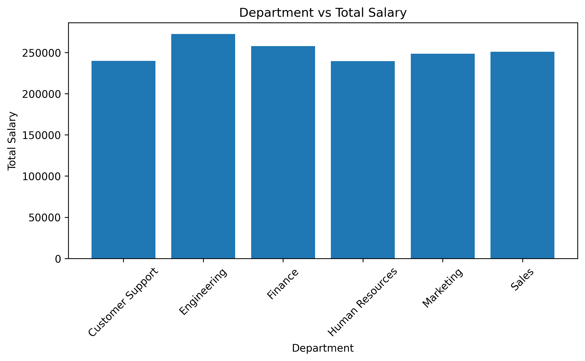
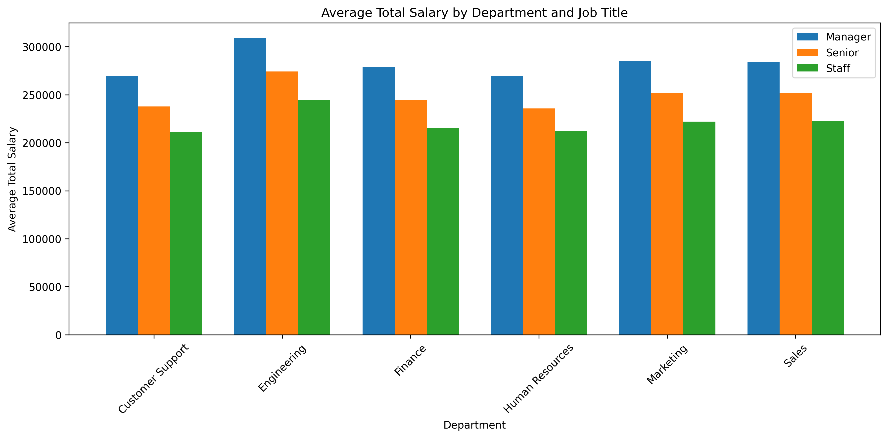

# データアナリスト　ポートフォリオ

## 自己紹介

約7年間、人事・労務業務に従事してきました。
現在はデータアナリストへの転職を目指し、
SQL・Python・pandasを中心に学習しています。

データ分析を通じて、
業務改善に貢献できるアナリストを目指しています。

## スキル

- SQL
- Python
- pandas
- PowerBI
- Excel
- Word
- PowerPoint

---

# Employee Analytics｜Department分析

## 概要

架空の従業員データをPythonで作成し、部署（Department）と役職（JobTitle）による給与水準の違いを分析しました。

## 分析結果

### Department別の平均TotalSalary

| Department | 平均TotalSalary |
|---|---:|
| Engineering | 272,492円 |
| Finance | 257,688円 |
| Sales | 250,765円 |
| Marketing | 248,562円 |
| Customer Support | 239,868円 |
| Human Resources | 239,575円 |

Engineeringは、全部署の中で最も平均TotalSalaryが高い結果となりました。

### Department × JobTitle別の平均TotalSalary

- 全部署で、給与水準は **Manager ＞ Senior ＞ Staff** の順でした。
- Engineeringは、Staff・Senior・Managerのすべての役職で最も高い給与水準でした。

## 考察（Insights）

Engineeringの給与水準が最も高いことは、部署ごとに設定した基本給（BaseSalary）の違いがTotalSalaryに反映された結果と考えられます。

また、すべての部署でManager ＞ Senior ＞ Staffの順に給与水準が高いことは、役職に応じた手当（PositionAllowance）の設定と一致しています。

以上より、Department別の基本給とJobTitle別の役職手当が、想定どおり給与差に反映されていることを確認できました。

## 分析Notebook

分析に使用したPython Notebookは、こちらです。

[employee_analysis.ipynb を開く](notebooks/employee_analysis.ipynb)
