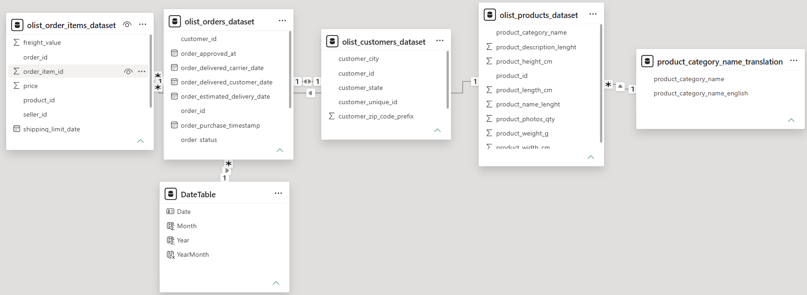

# Olist EC売上分析ダッシュボード

## 概要

OlistのECデータを使用し、売上状況や傾向を把握するためのダッシュボードをPower BIで作成しました。

売上推移・地域別売上・カテゴリ別売上を可視化し、主要KPIと期間スライサーを用いて売上状況を確認できる構成にしています。


## ダッシュボード


## 分析目的

1. 売上が時期によってどのように変化しているかを把握する。
2. 売上の大きい地域を確認する。
3. 売上に大きく貢献している商品カテゴリを確認する。


## 使用データ

Kaggleで公開されている「Brazilian E-Commerce Public Dataset by Olist」を使用しています。

- データ提供：Olist
- データ期間：2016年～2018年
- データセット：約10万件の注文データ
- 出典：[Brazilian E-Commerce Public Dataset by Olist（Kaggle）](https://www.kaggle.com/datasets/olistbr/brazilian-ecommerce)

本ダッシュボードでは、以下の5テーブルを使用しました。

| テーブル | 内容 |
|---|---|
| orders | 注文日時、注文ステータス、顧客IDなどの注文情報 |
| order_items | 商品ID、商品価格などの注文明細情報 |
| customers | 顧客ID、顧客の州などの顧客情報 |
| products | 商品ID、商品カテゴリなどの商品情報 |
| product_category_name_translation | 商品カテゴリ名のポルトガル語から英語への対応表 |


## 使用ツール・技術

- Power BI
- Power Query
- DAX
- データモデリング


## データモデル

複数のテーブルをリレーションシップで接続し、
注文・商品・顧客・カテゴリの情報を組み合わせて分析できるようにしました。

また、月別の売上推移や期間による絞り込みを行うため、
DateTableを作成し、注文データと接続しています。



主なリレーションシップ：

- orders と order_items：注文IDで接続
- orders と customers：顧客IDで接続
- order_items と products：商品IDで接続
- products と product_category_name_translation：商品カテゴリ名で接続
- DateTable と orders：注文日で接続


## KPI

ダッシュボードでは、配送完了（delivered）の注文を対象として、
以下のKPIを作成しました。

| KPI | 内容 |
|---|---|
| 総売上 | 配送完了した注文の商品価格の合計 |
| 注文数 | 配送完了した注文数 |
| 1注文あたり売上 | 総売上 ÷ 注文数 |
| 顧客数 | 配送完了した注文を行ったユニーク顧客数 |

### DAX

#### 総売上

```DAX
Total Sales =
CALCULATE(
    SUM(olist_order_items_dataset[price]),
    olist_orders_dataset[order_status] = "delivered"
)
```

#### 注文数

```DAX
Order Count =
CALCULATE(
    DISTINCTCOUNT(olist_orders_dataset[order_id]),
    olist_orders_dataset[order_status] = "delivered"
)
```

#### 1注文あたり売上

```DAX
Sales per Order =
DIVIDE(
    [Total Sales],
    [Order Count]
)
```

#### 顧客数

```DAX
Customer Count =
CALCULATE(
    DISTINCTCOUNT(olist_customers_dataset[customer_unique_id]),
    olist_orders_dataset[order_status] = "delivered"
)
```


## ダッシュボードから得られたInsights

### 売上推移

2017年11月に売上が大きく増加し、その後は増減を繰り返しながら高水準で推移しています。

2017年10月以前は月間売上がR$700,000を超えることはありませんでしたが、
2017年12月以降は概ねR$700,000を上回る水準で推移しており、
2017年11月を境に売上水準の変化が見られます。

月別売上だけでは増加の要因を特定できないため、
地域別・商品カテゴリ別などの観点から追加分析を行う必要があります。


### 地域別

SPの売上は上位10州の中で突出しており、
2位のRJとの差は約2.8倍です。

州別売上だけではSPの売上が大きい要因は特定できないため、
各州の注文数と1注文あたり売上を比較し、
売上差の要因をさらに分析する必要があります。


### 商品カテゴリ別

`health_beauty`の売上が最も大きく、約R$1.23Mでした。
続いて`watches_gifts`、`bed_bath_table`の順となっていますが、
上位3カテゴリの売上差は比較的小さいです。

商品カテゴリ別売上だけでは上位カテゴリの売上が大きい要因は特定できないため、
各商品カテゴリの注文数と1注文あたり売上を比較し、
売上差の要因をさらに分析する必要があります。


## 工夫した点

- 全体の状況を一目で把握できるよう、総売上・注文数・1注文あたり売上・顧客数の4つのKPIをダッシュボード上部に配置しました。
- 期間スライサーを設置し、指定した期間に応じてKPIや各グラフが連動して変化するようにしました。
- 月別売上推移は時系列の変化を把握しやすい折れ線グラフ、州別・商品カテゴリ別売上は売上規模を比較しやすい横棒グラフを使用し、分析目的に応じてグラフを使い分けました。
- グラフから読み取れる主な傾向を「分析サマリー（全期間）」として掲載し、ダッシュボード上で分析結果も確認できるようにしました。
